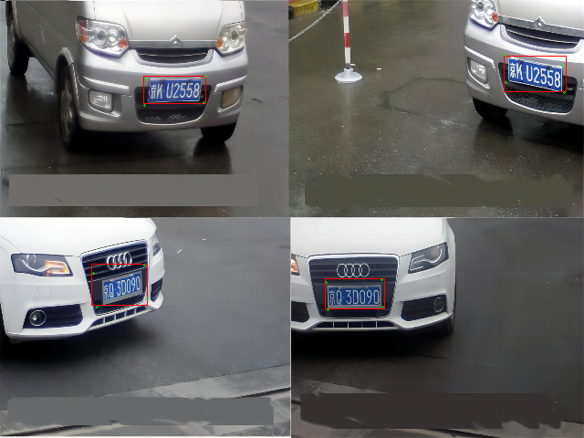
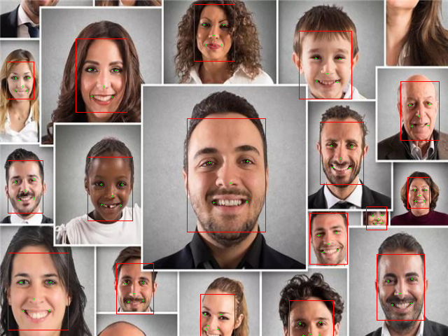

 <div align="center">

</div>

# CNET

CNET 是一个C99开发的的面向iot设备设计的深度学习推理库，实现深度学习算法在iot设备上的快速部署。


## 1 主要特点

- 极简，高效的内存管理，清晰的架构设计
- 扩展，模块化设计，轻松完成裁剪和扩展
- 轻便，完整的二进制库不到300kb
- 可靠，完善的内存监测测试， 无内存泄露
- 完善，支持现有的大量操作，可按需扩展
- 高效，纯C实现，逐步加入MCU汇编优化

架构简介：

```
----------------------------------------------------------------
 前      examples        推理结果校验/人脸检测及识别/车牌检测及识别
 后      
 处      c-netend        网络后处理模块：支持目标检测/人脸识别及车牌识别
 理      c-image         图像加载及保存，结果绘制，输入预处理
----------------------------------------------------------------
 神      c-network       神经网络组织及推理
 经      nn-case         模型转换工具
 网      cilibration     量化评估工具
 络      ncnn            模型优化/量化支撑/模型源
----------------------------------------------------------------
 基      c-utils         基础工具，包括容器，分配器，线程池等
 础      c-benchmark     性能评估，无外部依赖，可在MCU执行
 模      c-tester        单元测试支持，无外部依赖，可在MCU执行
 块      c-tensor        张量计算支持，基础操作及内存管理
----------------------------------------------------------------
```

## 2 支持情况

- 作为NCNN的延展，将NCNN模型直接优化并量化为部署模型，故可导入Caffe/Onnx/Mxnet/darknet模型；
- 全面量化支持，支持后量化训练, 支持INT16推理，后续将加入INT8推理;
- 支持ESP32 等主流芯片，理论上完全兼容支持c99的所有模块;
- 支持分类, 目标检测，人脸识别，车牌识别等主流算法；
- 采用直接对象定义模型，无需手动加载，扁平化结构；

### 2.1支持的算子列表

```c
    /// convolution
    convolution_operation_type,
    /// pooling
    pooling_operation_type,
    /// padding
    padding_operation_type,
    /// crop
    crop_operation_type,
    /// inner product
    inner_product_operation_type,
    /// activation
    activation_operation_type,
    /// batch norm
    batch_norm_operation_type,
    /// slice
    slice_operation_type,
    /// concat
    concat_operation_type,
    /// reshape
    reshape_operation_type,
    /// sigmoid
    sigmoid_operation_type,
    /// softmax
    softmax_operation_type,
    /// permute
    permute_operation_type,
    /// unary
    unary_operation_type,
    /// binary
    binary_operation_type,
    /// upsample
    upsample_operation_type,
    /// prelu
    prelu_operation_type,
    /// memory data
    memory_data_operation_type,
    /// shuffle_channel
    shuffle_channel_operation_type,
```

### 2.2 支持的激活函数

```c
    /// bnll
    bnll_activate_type,
    /// clip
    clip_activate_type,
    /// elu
    elu_activate_type,
    /// exp
    exp_activate_type,
    /// hard sigmoid
    hard_sigmoid_activate_type,
    /// hard swish
    hard_swish_activate_type,
    /// log
    log_activate_type,
    /// power
    power_activate_type,
    /// relu
    relu_activate_type,
    /// selu
    selu_activate_type,
    /// hard swish
    swish_activate_type,
    /// threshold
    threshold_activate_type,
```

## 3 案例展示

车牌识别 | 人脸识别
---------|----------
 |  
 车牌检测: retian/yolo, INT16 | 人脸检测: retian/yolo, INT16
 车牌矫正: 关键点检测 + 仿射变换 | 人脸矫正: 关键点+仿射变换
 车牌识别: 车牌+颜色 支持INT16  | 人脸验证: CNN + VECTOR， mobilenet-face


## 4. 路线图

- 支持ESP32，性能优化
- 支持INT8
- 支持ESP32系列INT8优化
- 其它芯片优化
- 操作优化支持
- 后端模型优化支持

## 5. 参与贡献

1. Fork 本仓库
2. 新建 Feat_xxx 分支
3. 提交代码
4. 新建 Pull Request